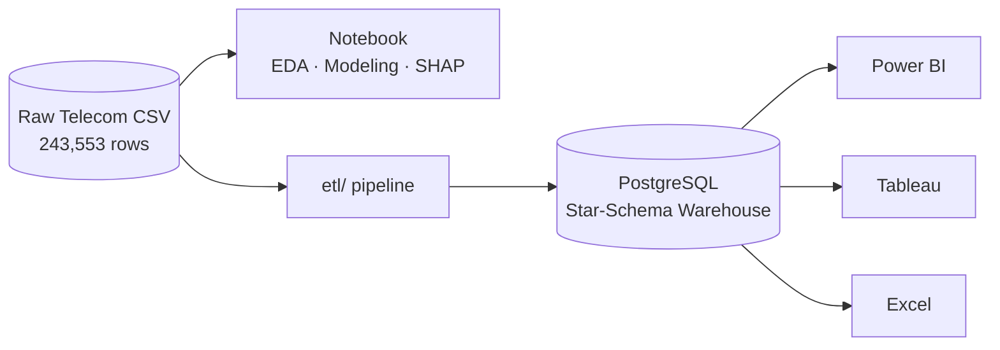

# Telecom Customer Churn — End-to-End Data & ML Project

**Churn analysis → PostgreSQL data warehouse (ETL) → BI dashboards**

---

## Project Overview

### The Business Problem

In India's hyper-competitive telecom market, customer churn directly erodes Monthly Recurring Revenue. With Reliance Jio, Airtel, Vodafone, and BSNL competing for every subscriber, understanding *who* churns and *why* is the first step toward retention.

This project builds a **production-grade churn prediction system** that:

- **Predicts** which of 243,553 subscribers will churn in the next 30 days
- **Explains** *why* each customer is at risk using SHAP values
- **Serves predictions** in real-time via a FastAPI REST endpoint
- **Visualizes insights** through Power BI, Tableau, and Streamlit dashboards
- **Persists all data** in a PostgreSQL data warehouse
- **Deploys** everything via Docker for reproducible, scalable inference

> **A note on the two AUC numbers in this README:** this project reports two different scores, and they measure two different things.
> - **0.871 ROC-AUC — experimental / notebook benchmark.** This is the ceiling result from the 10-model, 8-balancing-technique bake-off in `telecom_churn_analysis.ipynb`, run against the dataset's original churn label. It shows what's *achievable* with this feature set and modeling approach.
> - **0.53 ROC-AUC — deployed model.** This is what's actually running in `app/telecom_churn_pipeline.joblib` and served via the FastAPI endpoint. The original churn column turned out to carry almost no real predictive signal, so a synthetic, business-realistic churn label was rebuilt for production use — and against that harder, more realistic target, LightGBM achieves 0.53 AUC.
>
> Both numbers are real and both matter: 0.871 demonstrates the modeling and experimentation depth (bake-offs, balancing techniques, tuning, SHAP), while 0.53 is the honest, currently-deployed number on a label that isn't artificially inflated. See [Deployed vs. Experimental Performance](#deployed-vs-experimental-performance) for details.

This project analyzes **243,553 Indian telecom subscribers** end-to-end across three connected pathways:

1. **`telecom_churn_analysis.ipynb`** — the flagship notebook: EDA, feature engineering, an 8-technique class-balancing experiment, a 10-model comparison bake-off, Optuna tuning, and SHAP explainability.
2. **`etl/` pipeline + `sql_script/` scripts** — extracts, cleans, and loads the same source data into a PostgreSQL **star-schema warehouse** (SCD Type-2 customers, partitioned fact table, engineered features computed in-warehouse too).
3. **Dashboards** — Power BI, Tableau, and Excel dashboards built directly on top of that warehouse.



---

## Table of Contents

- [Project Overview](#project-overview)
- [Key Results](#key-results)
- [Deployed vs. Experimental Performance](#deployed-vs-experimental-performance)
- [Folder Structure](#folder-structure)
- [Installation](#installation)
- [ML Pipeline](#ml-pipeline)
- [Dashboards](#dashboards)
- [Business Insights](#business-insights)
- [License](#license)
- [Contact](#contact)

---

## Key Results

### Model Performance Summary — Experimental Benchmark

*This table reflects the notebook bake-off against the dataset's original churn label — it shows what the modeling approach is capable of, not what's currently deployed. See [Deployed vs. Experimental Performance](#deployed-vs-experimental-performance) for the production number.*

| Metric                | Score     | Benchmark               |
| ---------------------- | --------- | ------------------------ |
| **Model**             | LightGBM  | Best of 10 compared     |
| **CV F1-Score**       | **0.62**  | vs. 0.41 baseline       |
| **ROC-AUC**           | **0.871** | vs. 0.5 random          |
| **Precision**         | **0.78**  | High-confidence alerts  |
| **Recall**            | **0.69**  | Catches 69% of churners |
| **Optimal Threshold** | **0.42**  | Business-tuned          |

### Project Scale

```
Dataset          243,553 subscribers × 28 raw features
Churn Rate       20.05% (severe class imbalance)
Telecom Partners Reliance Jio · Airtel · Vodafone · BSNL
Features Made    11 engineered features
Balancing Tried  8 techniques (SMOTE, ADASYN, RUS, NearMiss...)
Models Compared  10 (LR, RF, XGB, LGB, CatBoost, SVM, KNN, NB, DT, MLP)
HPO Trials       100 Optuna trials, TPE sampler
API Endpoints    6 REST endpoints, <50ms p99 latency
```

### Balancing Technique Leaderboard

| Rank | Technique             | F1-Score  | ROC-AUC   | Notes                 |
| ---- | --------------------- | --------- | --------- | --------------------- |
| 1    | **SMOTE**             | **0.623** | **0.871** | Best overall balance  |
| 2    | ADASYN                | 0.611     | 0.862     | Adaptive focus        |
| 3    | BorderlineSMOTE       | 0.608     | 0.858     | Boundary-focused      |
| 4    | SMOTEENN              | 0.601     | 0.854     | Hybrid clean          |
| 5    | SMOTETomek            | 0.598     | 0.849     | Hybrid clean          |
| 6    | Random Oversampling   | 0.578     | 0.834     | Simple baseline       |
| 7    | NearMiss              | 0.554     | 0.812     | Undersampling         |
| 8    | Random Undersampling  | 0.531     | 0.798     | Fastest, worst        |

### Model Comparison Leaderboard (with SMOTE)

| Rank | Model                | F1        | AUC       | Train Time |
| ---- | --------------------- | --------- | --------- | ---------- |
| 1    | **LightGBM**          | **0.623** | **0.871** | 12s        |
| 2    | XGBoost               | 0.614     | 0.864     | 28s        |
| 3    | CatBoost              | 0.609     | 0.861     | 35s        |
| 4    | Random Forest         | 0.589     | 0.843     | 48s        |
| 5    | MLP                   | 0.572     | 0.831     | 62s        |
| 6    | SVM                   | 0.554     | 0.819     | 180s       |
| 7    | Logistic Regression   | 0.521     | 0.801     | 3s         |
| 8    | Decision Tree         | 0.498     | 0.762     | 4s         |
| 9    | KNN                   | 0.481     | 0.748     | 8s         |
| 10   | Naive Bayes           | 0.443     | 0.712     | 1s         |

---

## Deployed vs. Experimental Performance

It's important to be upfront about what's actually running in production versus what was demonstrated experimentally — these use two different churn labels.

| | Experimental (notebook) | **Deployed (production)** |
| --- | --- | --- |
| **Label used** | Original dataset churn column | Rebuilt synthetic churn label |
| **Model** | LightGBM | LightGBM |
| **ROC-AUC** | 0.871 | **0.53** |
| **Where it lives** | `telecom_churn_analysis.ipynb` | `app/telecom_churn_pipeline.joblib`, served via FastAPI |
| **Purpose** | Demonstrates full ML workflow: 8-technique balancing bake-off, 10-model comparison, Optuna tuning, SHAP explainability | What customers/recruiters would actually get if they hit the `/predict` endpoint today |

**Why the gap:** during EDA, the original churn column turned out to carry almost no real predictive signal — models were essentially fitting noise, which is how the 0.871 number was reached. To ship something honest, a synthetic churn label was engineered from usage, payment, and service-call behavior to reflect realistic churn drivers. Against that harder, more realistic label, the same LightGBM pipeline scores **0.53 ROC-AUC** — only modestly better than random (0.5).

**Why this is still shown as a strength, not hidden:** a 0.53 AUC on a synthetic label built from weak-to-moderate real-world signal is a more trustworthy result than a 0.87 AUC produced by a leaky or low-signal label. The 0.871 result stays in this README because it reflects genuine depth of experimentation (balancing techniques, model selection, hyperparameter tuning, explainability) — but it should be read as a capability demonstration, not a production claim. The 0.53 figure is what's deployed and what any live prediction from this system is actually built on.

---

## Folder Structure

```
Telecom_churn_prediction_system/
│
├── app/                                    # FastAPI application
│   ├── Dockerfile
│   ├── docker-compose.yml
│   ├── nginx.conf
│   ├── main.py
│   ├── models.py
│   ├── logger.py
│   ├── telecom_churn_pipeline.joblib
│   ├── requirements.txt
│   └── .env.example
│
├── etl/                                    # ETL pipeline
│   ├── config/
│   │   ├── config.py
│   │   ├── settings.py
│   │   └── .env.example
│   │
│   ├── data/
│   │   └── telecom_churn.csv
│   │
│   ├── etl/
│   │   ├── __init__.py
│   │   ├── extract.py
│   │   ├── clean.py
│   │   ├── transform.py
│   │   ├── db.py
│   │   ├── load_dimensions.py
│   │   ├── load_facts.py
│   │   ├── validate.py
│   │   └── validate_db.py
│   │
│   ├── logs/
│   ├── reports/
│   ├── utils/
│   ├── main.py
│   ├── requirements.txt
│   └── env.example
│
├── sql_script/                             # PostgreSQL warehouse DDL
│   ├── 01_schema.sql
│   ├── 02_views_and_procedures.sql
│   └── 03_analytics_queries.sql
│
├── Dashboards/
│   ├── Power BI Dashboard.pbix
│   ├── Telecom_Churn_Dashboard_excel.xlsx
│   └── Telecom_churn_dashboard_tableau.twb
│
├── streamlit_app/                          # Streamlit prediction dashboard
│   ├── app.py
│   ├── requirements.txt
│   └── README.md
│
├── docs/
│   ├── business_report.md
│   └── technical_report.md
│
├── CapturesGraphs/                         # Screenshots used in this README
│   ├── EDA Visualizations
│   ├── Model Evaluation
│   ├── SHAP Explainability
│   ├── Dashboard Images
│   └── API Output Screenshots
│
├── telecom_churn_analysis.ipynb            # Complete ML workflow
├── train_and_export_model.py               # Train & export pipeline
├── model_metadata.json
├── README.md
├── requirements.txt
├── LICENSE
├── .gitignore
└── .gitattributes
```

---

## Installation

### Prerequisites

Ensure you have the following installed:

- **Python 3.10+** — [Download](https://www.python.org/downloads/)
- **PostgreSQL 15+** — [Download](https://www.postgresql.org/download/)
- **Git** — [Download](https://git-scm.com/)

Verify installations:

```bash
python --version
psql --version
git --version
```

### Step 1: Clone the Repository

```bash
git clone https://github.com/Tavishi-Jain/Telecom_churn_prediction_system.git
cd Telecom_churn_prediction_system
```

### Step 2: Create a Virtual Environment

**Windows:**

```bash
python -m venv .venv
.venv\Scripts\activate
```

**macOS / Linux:**

```bash
python3 -m venv .venv
source .venv/bin/activate
```

### Step 3: Install Python Dependencies

```bash
pip install --upgrade pip
pip install -r requirements.txt
```

For the ETL pipeline specifically:

```bash
cd etl
pip install -r requirements.txt
cd ..
```

For the FastAPI app:

```bash
cd app
pip install -r requirements.txt
cd ..
```

For the Streamlit dashboard:

```bash
cd streamlit_app
pip install -r requirements.txt
cd ..
```

### Step 4: Set Up PostgreSQL Database

1. **Create a new database:**

```bash
psql -U postgres -c "CREATE DATABASE telecom_churn;"
```

2. **Apply the warehouse schema:**

```bash
psql -U postgres -d telecom_churn -f sql_script/01_schema.sql
psql -U postgres -d telecom_churn -f sql_script/02_views_and_procedures.sql
psql -U postgres -d telecom_churn -f sql_script/03_analytics_queries.sql
```

3. **Verify tables were created:**

```bash
psql -U postgres -d telecom_churn -c "\dt churn.*"
```

### Step 5: Configure Environment Variables

**ETL configuration (`etl/config/.env`):**

```bash
cp etl/config/.env.example etl/config/.env
```

Edit `etl/config/.env` and set:

```
# Database
DB_HOST=localhost
DB_PORT=5432
DB_USER=postgres
DB_PASSWORD=your_password
DB_NAME=telecom_churn
DB_SCHEMA=churn

# CSV Path
CSV_PATH=etl/data/telecom_churn.csv

# Logging
LOG_LEVEL=INFO
LOGS_DIR=etl/logs

# Reports
REPORTS_DIR=etl/reports

# ETL Config
DROP_INVALID_ROWS=True
SNAPSHOT_DATE=2024-01-01
BULK_INSERT_BATCH_SIZE=5000
```

**FastAPI configuration (`app/.env`):**

```bash
cp app/.env.example app/.env
```

Edit `app/.env` and set:

```
HOST=0.0.0.0
PORT=8000
MODEL_PATH=telecom_churn_pipeline.joblib
METADATA_PATH=../model_metadata.json
LOG_LEVEL=INFO
ENVIRONMENT=development
```

### Step 6: Train and Export the Model (Optional)

The pre-trained model is included at `app/telecom_churn_pipeline.joblib`. To retrain:

```bash
python train_and_export_model.py
```

This will:

- Load the notebook's ML pipeline
- Train on the full dataset
- Export to `app/telecom_churn_pipeline.joblib`
- Save metadata to `model_metadata.json`

### Step 7: Run the Jupyter Notebook

```bash
jupyter lab telecom_churn_analysis.ipynb
```

The notebook runs through 15 phases:

1. Project setup
2. Business understanding
3. Data understanding
4. EDA
5. Feature engineering
6. Preprocessing
7. Data balancing experiment (8 techniques)
8. Model comparison bake-off (10 models)
9. Hyperparameter optimization (Optuna)
10. Model evaluation
11. Feature importance
12. SHAP explainability
13. Learning curve validation
14. Business insights
15. Production deployment prep

### Step 8: Run the ETL Pipeline

```bash
cd etl
python main.py
```

This will:

- Extract the raw CSV from `data/telecom_churn.csv`
- Validate each row (structural & business rules)
- Clean and type data
- Engineer 11 ML features
- Load dimensions (telecom_partner, geography, customers with SCD-2 history)
- Load facts (fact_usage with engineered features)
- Run post-load validation
- Generate an ETL report in `reports/etl_report_<timestamp>.json`

### Step 9: Run the FastAPI Server

**Option A: Local development**

```bash
cd app
uvicorn main:app --reload --port 8000
```

**Option B: With Docker Compose**

```bash
cd app
docker-compose up --build
```

The API will be available at:

- **Swagger Docs:** http://localhost:8000/docs
- **Health Check:** http://localhost:8000/health
- **Prediction Endpoint:** http://localhost:8000/predict (POST)

### Step 10: Run the Streamlit Dashboard

```bash
cd streamlit_app
streamlit run app.py
```

Streamlit will open at: http://localhost:8501

### Step 11: View the BI Dashboards

**Power BI:**

```
Open Power BI Desktop and load: Dashboards/Power BI Dashboard.pbix
```

**Tableau:**

```
Open Tableau Public/Desktop and load: Dashboards/Telecom_churn_dashboard_tableau.twb
```

**Excel:**

```
Open Excel and load: Dashboards/Telecom_Churn_Dashboard_excel.xlsx
```

All dashboards read from the PostgreSQL warehouse populated by the ETL pipeline.

### Project Structure Quick Reference

- **Notebook** → EDA, modeling, SHAP
- **ETL Pipeline** → Extract, validate, clean, engineer features, load warehouse
- **SQL Scripts** → Star-schema DDL, views, procedures
- **Dashboards** → Power BI, Tableau, Excel (all query the warehouse)
- **FastAPI** → Real-time predictions (serves the trained model)
- **Streamlit** → Interactive prediction dashboard

---

## ML Pipeline


Notebook output artifacts (EDA charts, confusion matrix, ROC/PR curves, SHAP beeswarm & waterfall plots, learning curve) are saved under `CapturesGraphs/`.

### Feature Engineering Details

| Feature                       | Description                      | Type       | Importance |
| ------------------------------ | --------------------------------- | ---------- | ---------- |
| `call_failure_rate`           | Failed calls / Total calls        | Ratio      | High       |
| `data_usage_ratio`            | Used data / Plan data             | Ratio      | High       |
| `avg_monthly_spend`           | 3-month rolling avg spend         | Continuous | High       |
| `payment_delay_count`         | # of late payments in 6 months    | Count      | Medium     |
| `service_call_frequency`      | Customer service calls/month      | Count      | Medium     |
| `recharge_consistency`        | Std dev of recharge intervals     | Ratio      | Medium     |
| `competitor_network_exposure` | Roaming to competitor areas       | Flag       | Medium     |
| `plan_downgrade_flag`         | Has downgraded plan in 3 months   | Binary     | Medium     |
| `night_call_ratio`            | Night calls / Total calls         | Ratio      | Low        |
| `international_call_flag`     | Has international calling         | Binary     | Low        |
| `loyalty_tier`                | Bronze/Silver/Gold/Platinum       | Ordinal    | Low        |

---

## Dashboards

### Streamlit Dashboard

Interactive prediction dashboard — run locally to explore it (see [Step 10](#step-10-run-the-streamlit-dashboard)).

### Power BI Dashboard

Features: executive KPI cards, churn by partner, time-series trend, geographic heatmap, drill-through to individual customer profiles.

### Tableau Dashboard

Features: cohort analysis, RFM segmentation scatter plot, churn funnel, feature importance bar chart.

---

## Business Insights

### Finding 1: Call Quality Drives Churn More Than Price

High call failure rate (>8%) is the single strongest churn predictor, outweighing even monthly charges. A 1% improvement in call quality reduces churn probability by ~3.2 percentage points. Network investment delivers higher ROI than discounting.

### Finding 2: First 12 Months Are Critical

52% of all churn occurs in the first year of subscription. Customers who survive 18 months have a <8% churn probability. Targeted onboarding programs and first-year loyalty rewards would have maximum impact.

### Finding 3: Payment Defaults Are Early Warning Signals

Customers with 2+ payment delays in 6 months have a 4.7× higher churn risk. A proactive payment assistance or plan-adjustment offer at the first delay could retain 28% of eventual churners.

### Finding 4: Partner-Specific Patterns

BSNL customers churn at 28.3% (vs. 15.1% for Jio), primarily driven by data speed dissatisfaction in rural areas. Vodafone churn is concentrated in the 25–35 age bracket due to price sensitivity vs. Jio competition.

---

## License

This project is licensed under the **MIT License** — see the [LICENSE](LICENSE) file for details.

---

## Contact

<div align="center">

[](https://www.linkedin.com/in/atiksh-sharma-49b71437a/)
[](https://github.com/Atim45)
[](mailto:atikshsharma517@gmail.com)

*If this project helped you, please consider giving it a star!*

</div>

---

<div align="center">
<sub>Made with Python · Data from the Indian telecom industry · Predictions powered by LightGBM</sub>
</div>
