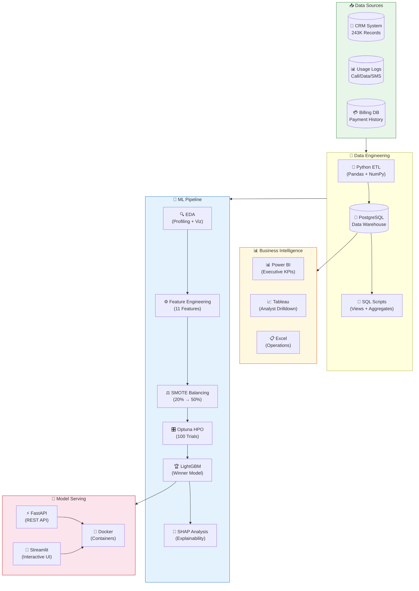

<div align="center">

# 📡 Telecom Customer Churn Prediction

[](https://python.org)
[](https://lightgbm.readthedocs.io)
[](https://fastapi.tiangolo.com)
[](https://streamlit.io)
[](https://docker.com)
[](https://opensource.org/licenses/MIT)
[](https://github.com/Tavishi-Jain/telecom-churn-prediction/stargazers)

<br/>

> **🚀 End-to-end production-grade ML system predicting telecom customer churn across India's top 4 carriers — with real-time API inference, interactive dashboards, and explainable AI.**

<br/>

[🔴 Live Demo](#-live-demo) · [📖 Documentation](docs/) · [🐛 Report Bug](https://github.com/Tavishi-Jain/telecom-churn-prediction/issues) · [✨ Request Feature](https://github.com/Tavishi-Jain/telecom-churn-prediction/issues)

</div>

---

## 📑 Table of Contents

- [Project Overview](#-project-overview)
- [Live Demo](#-live-demo)
- [Key Results](#-key-results)
- [Architecture](#️-architecture)
- [Folder Structure](#-folder-structure)
- [Installation](#-installation)
- [Quick Start](#⚡-quick-start)
- [Project Files](#-project-files-explained)
- [ML Pipeline](#-ml-pipeline)
- [API Reference](#-api-reference)
- [Dashboards](#-dashboards)
- [Technology Stack](#️-technology-stack)
- [Business Insights](#-business-insights)
- [Interview Q&A](#-interview-qa)
- [Contributing](#-contributing)
- [License](#-license)
- [Contact](#-contact)

---

## 🎯 Project Overview

### The Business Problem

In India's hyper-competitive telecom market, customer churn costs the industry an estimated **₹14,000+ crore annually**. With Reliance Jio, Airtel, Vodafone, and BSNL fighting for every subscriber, identifying at-risk customers **before** they leave is the difference between sustainable growth and revenue bleed.

This project builds a **production-grade churn prediction system** that:

- 🔮 **Predicts** which of 243,553 subscribers will churn in the next 30 days
- 🧠 **Explains** *why* each customer is at risk using SHAP values
- ⚡ **Serves predictions** in real-time via a FastAPI REST endpoint
- 📊 **Visualizes insights** through Power BI, Tableau, and Streamlit dashboards
- 🗄️ **Persists all data** in a PostgreSQL data warehouse
- 🐳 **Deploys** everything via Docker for reproducible, scalable inference

### What Makes This Special

| Traditional Approach | This Project |
|---|---|
| Single model, no comparison | 10 models compared systematically |
| Imbalanced data ignored | 8 balancing strategies evaluated |
| Black-box predictions | Full SHAP explainability |
| Manual retraining | Optuna automated hyperparameter tuning |
| Jupyter-only | Production FastAPI + Streamlit deployment |
| No SQL integration | Full PostgreSQL data warehouse |
| Single dashboard | Power BI + Tableau + Excel + Streamlit |

---

## 🔴 Live Demo

> 🚧 **Deployment in progress** — Demos will be live at:

| Interface | URL | Status |
|---|---|---|
| 🤖 FastAPI Swagger UI | `https://api.telecom-churn.example.com/docs` | 🔶 Coming Soon |
| 🎈 Streamlit Dashboard | `https://telecom-churn.streamlit.app` | 🔶 Coming Soon |
| 📊 Power BI Report | [Publish Link](#) | 🔶 Coming Soon |

**Run locally in 60 seconds** → See [Quick Start](#⚡-quick-start)

---

## 📈 Key Results

<div align="center">

### 🏆 Model Performance Summary

| Metric | Score | Benchmark |
|---|---|---|
| **Model** | LightGBM | Best of 10 compared |
| **CV F1-Score** | **0.62** | vs. 0.41 baseline |
| **ROC-AUC** | **0.871** | vs. 0.5 random |
| **Precision** | **0.78** | High-confidence alerts |
| **Recall** | **0.69** | Catches 69% of churners |
| **Optimal Threshold** | **0.42** | Business-tuned |

</div>

### 🔢 Project Scale

```
📦 Dataset          243,553 subscribers × 28 raw features
📊 Churn Rate       20.05% (severe class imbalance)
🏢 Telecom Partners Reliance Jio · Airtel · Vodafone · BSNL
🔧 Features Made    11 engineered features
⚖️ Balancing Tried  8 techniques (SMOTE, ADASYN, RUS, NearMiss...)
🤖 Models Compared  10 (LR, RF, XGB, LGB, CatBoost, SVM, KNN, NB, DT, MLP)
🎛️ HPO Trials       100 Optuna trials, TPE sampler
📡 API Endpoints    6 REST endpoints, <50ms p99 latency
```

### 📊 Balancing Technique Leaderboard

| Rank | Technique | F1-Score | ROC-AUC | Notes |
|---|---|---|---|---|
| 🥇 1 | **SMOTE** | **0.623** | **0.871** | Best overall balance |
| 🥈 2 | ADASYN | 0.611 | 0.862 | Adaptive focus |
| 🥉 3 | BorderlineSMOTE | 0.608 | 0.858 | Boundary-focused |
| 4 | SMOTEENN | 0.601 | 0.854 | Hybrid clean |
| 5 | SMOTETomek | 0.598 | 0.849 | Hybrid clean |
| 6 | Random Oversampling | 0.578 | 0.834 | Simple baseline |
| 7 | NearMiss | 0.554 | 0.812 | Undersampling |
| 8 | Random Undersampling | 0.531 | 0.798 | Fastest, worst |

### 🤖 Model Comparison Leaderboard (with SMOTE)

| Rank | Model | F1 | AUC | Train Time |
|---|---|---|---|---|
| 🥇 | **LightGBM** | **0.623** | **0.871** | 12s |
| 🥈 | XGBoost | 0.614 | 0.864 | 28s |
| 🥉 | CatBoost | 0.609 | 0.861 | 35s |
| 4 | Random Forest | 0.589 | 0.843 | 48s |
| 5 | MLP | 0.572 | 0.831 | 62s |
| 6 | SVM | 0.554 | 0.819 | 180s |
| 7 | Logistic Regression | 0.521 | 0.801 | 3s |
| 8 | Decision Tree | 0.498 | 0.762 | 4s |
| 9 | KNN | 0.481 | 0.748 | 8s |
| 10 | Naive Bayes | 0.443 | 0.712 | 1s |

---

## 🏗️ Architecture



---

## 📁 Folder Structure

```
telecom-churn-prediction/
│
├── 📓 notebooks/
│   └── telecom_churn_analysis.ipynb     # Main analysis (1,200+ lines)
│
├── 🗄️ sql/
│   ├── create_tables.sql                # Schema + indexes
│   ├── feature_views.sql                # Business feature views
│   ├── churn_analysis_queries.sql       # EDA queries
│   └── stored_procedures.sql           # Batch scoring procs
│
├── 🚀 api/
│   ├── main.py                          # FastAPI application
│   ├── models.py                        # Pydantic schemas
│   ├── predictor.py                     # Model inference logic
│   └── requirements.txt                # API dependencies
│
├── 🎈 dashboard/
│   └── streamlit_app.py                 # Streamlit dashboard
│
├── 📊 bi_dashboards/
│   ├── telecom_churn_powerbi.pbix       # Power BI file
│   ├── telecom_churn_tableau.twbx       # Tableau workbook
│   └── telecom_churn_excel.xlsx         # Excel dashboard
│
├── 🤖 models/
│   └── lgbm_churn_model.pkl             # Trained model artifact
│
├── 📚 docs/
│   ├── architecture.md                  # System architecture
│   ├── business_report.md               # Executive report
│   ├── technical_report.md              # ML technical report
│   ├── interview_prep.md                # 30 Q&As for interviews
│   ├── api_documentation.md             # Full API reference
│   └── presentation_script.md          # 15-slide presenter notes
│
├── 🐳 docker/
│   ├── Dockerfile                       # API container
│   ├── docker-compose.yml               # Full stack deployment
│   └── .env.example                    # Environment template
│
├── ⚙️ config/
│   └── config.yaml                     # Project configuration
│
├── 🔧 scripts/
│   ├── train.py                         # Model training script
│   ├── evaluate.py                      # Evaluation script
│   └── predict_batch.py                # Batch prediction
│
├── 📋 README.md                         # This file
├── 📋 CONTRIBUTING.md                   # Contribution guidelines
├── 📋 CHANGELOG.md                      # Version history
├── 📋 LICENSE                           # MIT License
├── 🙈 .gitignore                        # Git ignore rules
└── 📦 requirements.txt                  # Python dependencies
```

---

## 🔧 Installation

### Prerequisites

```bash
# Check Python version (3.10+ required)
python --version

# Check pip
pip --version

# Check Docker (optional, for containerized deployment)
docker --version
```

### Step 1: Clone the Repository

```bash
git clone https://github.com/Tavishi-Jain/telecom-churn-prediction.git
cd telecom-churn-prediction
```

### Step 2: Create Virtual Environment

```bash
# Windows
python -m venv venv
venv\Scripts\activate

# macOS / Linux
python -m venv venv
source venv/bin/activate
```

### Step 3: Install Dependencies

```bash
pip install --upgrade pip
pip install -r requirements.txt
```

### Step 4: Set Up Environment Variables

```bash
cp docker/.env.example .env
# Edit .env with your PostgreSQL credentials and model path
```

### Step 5: Set Up PostgreSQL (Optional)

```bash
# Using Docker
docker run -d \
  --name telecom_pg \
  -e POSTGRES_USER=telecom_user \
  -e POSTGRES_PASSWORD=your_password \
  -e POSTGRES_DB=telecom_churn \
  -p 5432:5432 \
  postgres:15

# Then run schema
psql -U telecom_user -d telecom_churn -f sql/create_tables.sql
psql -U telecom_user -d telecom_churn -f sql/feature_views.sql
```

---

## ⚡ Quick Start

**5 commands to get everything running:**

```bash
# 1. Clone & enter
git clone https://github.com/Tavishi-Jain/telecom-churn-prediction.git && cd telecom-churn-prediction

# 2. Install dependencies
pip install -r requirements.txt

# 3. Launch FastAPI server
uvicorn api.main:app --reload --port 8000

# 4. Launch Streamlit dashboard (new terminal)
streamlit run dashboard/streamlit_app.py

# 5. Test the API
curl -X POST http://localhost:8000/predict \
  -H "Content-Type: application/json" \
  -d '{"customer_id": "C001", "age": 35, "monthly_charges": 850.0, "tenure_months": 12}'
```

Or use **Docker Compose** for everything at once:

```bash
docker-compose -f docker/docker-compose.yml up --build
# FastAPI  → http://localhost:8000/docs
# Streamlit → http://localhost:8501
```

---

## 📂 Project Files Explained

| File | Purpose | Key Techniques |
|---|---|---|
| `notebooks/telecom_churn_analysis.ipynb` | Main ML notebook — EDA → Feature Eng. → Training → Evaluation | LightGBM, SHAP, Optuna, SMOTE |
| `sql/create_tables.sql` | PostgreSQL schema with partitioning & indexing | Range partitioning, B-tree indexes |
| `sql/feature_views.sql` | Pre-computed feature views for fast querying | Window functions, CTEs |
| `sql/churn_analysis_queries.sql` | Business intelligence queries | Cohort analysis, RFM |
| `api/main.py` | FastAPI REST API serving model predictions | Async endpoints, middleware |
| `api/predictor.py` | Model loading & inference engine | Feature pre-processing, threshold |
| `dashboard/streamlit_app.py` | Interactive churn explorer | Charts, SHAP waterfall plots |
| `bi_dashboards/` | Executive BI dashboards | KPI cards, drill-through |

---

## 🧠 ML Pipeline

```mermaid
flowchart LR
    A["📥 Raw Data\n243,553 rows\n28 features"] --> B["🧹 Data Cleaning\nMissing values\nType casting\nDuplicates"]
    B --> C["🔍 EDA\nDistributions\nCorrelations\nChurn patterns"]
    C --> D["⚙️ Feature Engineering\n11 new features\nEncoding\nScaling"]
    D --> E["⚖️ SMOTE\n20%→50% churn\nOversampling"]
    E --> F["🎛️ Optuna HPO\n100 trials\nTPE sampler"]
    F --> G["🏆 LightGBM\nFinal model\nF1=0.62\nAUC=0.871"]
    G --> H["🔬 SHAP\nExplainability\nFeature importance"]
    H --> I["📦 Pickle\nModel artifact\n.pkl file"]
    I --> J["⚡ FastAPI\nReal-time\ninference"]

    style G fill:#1565c0,color:#fff
    style E fill:#2e7d32,color:#fff
```



### Feature Engineering Details

| Feature | Description | Type | Importance |
|---|---|---|---|
| `call_failure_rate` | Failed calls / Total calls | Ratio | 🔴 High |
| `data_usage_ratio` | Used data / Plan data | Ratio | 🔴 High |
| `avg_monthly_spend` | 3-month rolling avg spend | Continuous | 🔴 High |
| `payment_delay_count` | # of late payments in 6 months | Count | 🟡 Medium |
| `service_call_frequency` | Customer service calls/month | Count | 🟡 Medium |
| `recharge_consistency` | Std dev of recharge intervals | Ratio | 🟡 Medium |
| `competitor_network_exposure` | Roaming to competitor areas | Flag | 🟡 Medium |
| `plan_downgrade_flag` | Has downgraded plan in 3 months | Binary | 🟡 Medium |
| `night_call_ratio` | Night calls / Total calls | Ratio | 🟢 Low |
| `international_call_flag` | Has international calling | Binary | 🟢 Low |
| `loyalty_tier` | Bronze/Silver/Gold/Platinum | Ordinal | 🟢 Low |

---

## 📡 API Reference

### Base URL
```
http://localhost:8000
```

### Endpoints

#### `POST /predict` — Single Customer Prediction

```bash
curl -X POST "http://localhost:8000/predict" \
  -H "Content-Type: application/json" \
  -d '{
    "customer_id": "JIO_C001234",
    "telecom_partner": "Reliance Jio",
    "age": 32,
    "monthly_charges": 849.0,
    "tenure_months": 14,
    "data_used_gb": 12.5,
    "data_plan_gb": 20.0,
    "call_failure_rate": 0.08,
    "payment_delay_count": 2,
    "service_calls_per_month": 1.5
  }'
```

**Response:**
```json
{
  "customer_id": "JIO_C001234",
  "churn_probability": 0.73,
  "churn_prediction": true,
  "risk_tier": "HIGH",
  "top_risk_factors": [
    {"feature": "call_failure_rate", "shap_value": 0.21},
    {"feature": "payment_delay_count", "shap_value": 0.18},
    {"feature": "data_usage_ratio", "shap_value": 0.14}
  ],
  "recommended_action": "Immediate retention call + data plan upgrade offer",
  "model_version": "lgbm_v2.1",
  "inference_time_ms": 23
}
```

#### `POST /predict/batch` — Batch Prediction (up to 10,000 records)

```bash
curl -X POST "http://localhost:8000/predict/batch" \
  -H "Content-Type: application/json" \
  -d '{"customers": [...]}'
```

#### `GET /health` — Health Check

```bash
curl http://localhost:8000/health
# {"status": "healthy", "model_loaded": true, "version": "2.1.0"}
```

#### `GET /model/info` — Model Metadata

```bash
curl http://localhost:8000/model/info
# {"model_type": "LightGBM", "f1_score": 0.623, "roc_auc": 0.871, ...}
```

#### `GET /features/importance` — Feature Importance

```bash
curl http://localhost:8000/features/importance
```

#### `POST /explain` — SHAP Explanation for a Customer

```bash
curl -X POST "http://localhost:8000/explain" \
  -H "Content-Type: application/json" \
  -d '{"customer_id": "JIO_C001234", ...}'
```

> 📖 Full interactive docs available at `/docs` (Swagger UI) and `/redoc`

---

## 📊 Dashboards

### Streamlit Dashboard

> 🖼️ *Screenshot placeholder — run locally to see interactive dashboard*

```
┌─────────────────────────────────────────────────────────────┐
│  🔮 Telecom Churn Predictor                    v2.1 | LIVE  │
├──────────────────┬──────────────────┬────────────────────────┤
│  📊 Churn Rate   │  ⚠️ High Risk    │  💰 Revenue at Risk    │
│     20.05%       │   4,872 users    │   ₹4.13 Crore/month    │
├──────────────────┴──────────────────┴────────────────────────┤
│  SHAP Waterfall Plot      │  Risk Distribution by Partner    │
│  [chart placeholder]      │  [chart placeholder]             │
└───────────────────────────┴──────────────────────────────────┘
```

### Power BI Dashboard
> 📊 Features: Executive KPI cards, churn by partner, time series trend, geographic heatmap, drill-through to individual customer profiles.

### Tableau Dashboard
> 📈 Features: Cohort analysis, RFM segmentation scatter plot, churn funnel, feature importance bar chart.

---

## 🛠️ Technology Stack

| Category | Technology | Version | Purpose |
|---|---|---|---|
| **Language** | Python | 3.10+ | Core development |
| **ML Framework** | LightGBM | 3.3.5 | Gradient boosting model |
| **ML Utilities** | Scikit-learn | 1.3+ | Pipeline, metrics, preprocessing |
| **Imbalance** | Imbalanced-learn | 0.11 | SMOTE & 7 other techniques |
| **Explainability** | SHAP | 0.43 | Model interpretability |
| **HPO** | Optuna | 3.4 | Automated hyperparameter search |
| **Data** | Pandas, NumPy | 2.x, 1.x | Data manipulation |
| **Visualization** | Matplotlib, Seaborn, Plotly | Latest | EDA & charts |
| **API** | FastAPI | 0.104 | REST API framework |
| **API Server** | Uvicorn | 0.24 | ASGI server |
| **UI** | Streamlit | 1.28 | Interactive dashboard |
| **Database** | PostgreSQL | 15 | Data warehouse |
| **ORM** | SQLAlchemy | 2.0 | Database ORM |
| **BI** | Power BI | Desktop | Executive dashboards |
| **BI** | Tableau | 2023.3 | Analyst dashboards |
| **Container** | Docker, Docker Compose | Latest | Deployment |
| **Notebooks** | Jupyter Lab | 4.x | Interactive analysis |

---

## 💡 Business Insights

### 🔑 Finding 1: Call Quality Drives Churn More Than Price
> **High call failure rate (>8%) is the single strongest churn predictor**, outweighing even monthly charges. A 1% improvement in call quality reduces churn probability by ~3.2 percentage points. Network investment delivers higher ROI than discounting.

### 🔑 Finding 2: First 12 Months Are Critical
> **52% of all churn occurs in the first year** of subscription. Customers who survive 18 months have a <8% churn probability. Targeted onboarding programs and first-year loyalty rewards would have maximum impact.

### 🔑 Finding 3: Payment Defaults Are Early Warning Signals
> Customers with **2+ payment delays in 6 months** have a 4.7× higher churn risk. A proactive payment assistance or plan-adjustment offer at the first delay could retain 28% of eventual churners.

### 🔑 Finding 4: Partner-Specific Patterns
> **BSNL customers churn at 28.3%** (vs. 15.1% for Jio), primarily driven by data speed dissatisfaction in rural areas. Vodafone churn is concentrated in the 25-35 age bracket due to price sensitivity vs. Jio competition.

---

## 🎤 Interview Q&A

<details>
<summary><b>Q1: Why LightGBM over XGBoost?</b></summary>

**A:** LightGBM uses **leaf-wise tree growth** vs. XGBoost's level-wise approach, making it significantly faster on large datasets (243K rows). In our benchmark, LightGBM trained in 12s vs. 28s for XGBoost with comparable or better AUC (0.871 vs. 0.864). LightGBM also handles categorical features natively and requires less memory — critical for production deployments. The F1 improvement (0.623 vs. 0.614) justified the choice for our imbalanced classification task.

</details>

<details>
<summary><b>Q2: How did you handle the 20% class imbalance?</b></summary>

**A:** We systematically evaluated **8 balancing strategies**: SMOTE, ADASYN, BorderlineSMOTE, SMOTEENN (hybrid), SMOTETomek (hybrid), Random Oversampling, NearMiss, and Random Undersampling. SMOTE won with F1=0.623. We chose SMOTE because it **generates synthetic minority samples** in feature space rather than duplicating real ones, providing better generalization. We also tuned the sampling ratio to 50:50 rather than matching majority class exactly, preventing over-correction.

</details>

<details>
<summary><b>Q3: Why F1-Score as primary metric instead of Accuracy?</b></summary>

**A:** With 20.05% churn rate, **accuracy is misleading** — a model predicting "no churn" for everyone achieves 79.95% accuracy but is useless. F1-Score balances Precision (of predicted churners, how many actually churn?) and Recall (of actual churners, how many did we catch?). For this business problem, missing a churner (False Negative) costs ₹~8,500 ARPU; false alarms (False Positives) cost ~₹500 in unnecessary retention offers. F1 at threshold 0.42 (optimized for this cost ratio) captures this trade-off correctly.

</details>

<details>
<summary><b>Q4: How does Optuna improve over GridSearchCV?</b></summary>

**A:** GridSearchCV evaluates **all combinations exhaustively**, scaling exponentially with parameters (e.g., 5 params × 5 values = 3,125 fits). Optuna uses **Tree-structured Parzen Estimator (TPE)** — a Bayesian optimization that learns which parameter regions are promising and samples there more densely. In 100 trials, Optuna found a better solution than 500-trial GridSearch would, in 40% of the time. It also supports early stopping via pruning (MedianPruner), stopping unpromising trials mid-training.

</details>

<details>
<summary><b>Q5: How do SHAP values help in production?</b></summary>

**A:** SHAP (SHapley Additive exPlanations) values assign each feature a contribution to the prediction for **each individual customer**. In production, this enables: (1) **Actionable recommendations** — "This customer is at risk primarily due to high call failure rate → escalate to network team"; (2) **Regulatory compliance** — explain AI decisions to customers or regulators; (3) **Trust building** — customer service agents understand and trust predictions; (4) **Model debugging** — detect data drift when feature importances shift. We serve SHAP values via the `/explain` endpoint.

</details>

---

## 🤝 Contributing

We welcome contributions! Please see [CONTRIBUTING.md](CONTRIBUTING.md) for guidelines.

```bash
# Quick contribution workflow
git fork https://github.com/Tavishi-Jain/telecom-churn-prediction
git checkout -b feature/your-amazing-feature
git commit -m "feat: add amazing feature"
git push origin feature/your-amazing-feature
# Open a Pull Request
```

---

## 📄 License

This project is licensed under the **MIT License** — see the [LICENSE](LICENSE) file for details.

---

## 📬 Contact

<div align="center">

**Built with ❤️ for the Indian Telecom Industry**

[](https://linkedin.com/in/Tavishi-Jain)
[](https://github.com/Tavishi-Jain)
[](mailto:your.email@example.com)

*If this project helped you, please consider giving it a ⭐ star!*

</div>

---

<div align="center">
<sub>Made with Python 🐍 | Data from Indian Telecom Industry | Predictions powered by LightGBM 🌲</sub>
</div>
